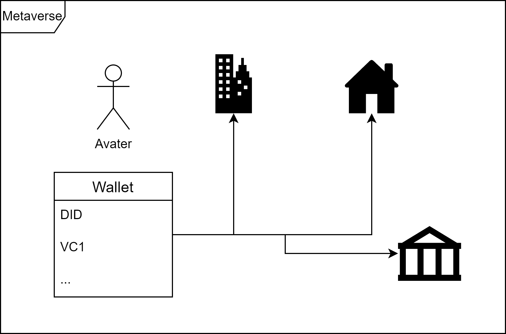
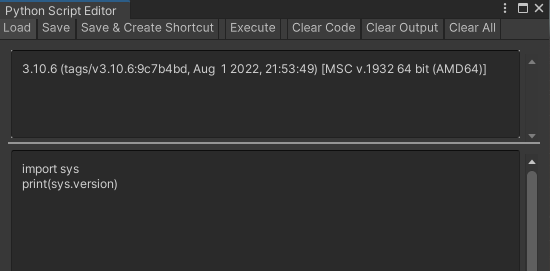

# Avata DID

Metaverse에서 사용하기 위한 Avata에 DID 적용


  
# Unity에 Hyperledger Indy 적용(DID)

## python wrapper 사용

### Unity에서 Python 사용

Unity에선 Python을 위한 기능을 제공하고 있으며 이는 패키지 매니저를 통해 다운받을 수 있다. [자세한 정보는 링크에 있다.](https://docs.unity3d.com/Packages/com.unity.scripting.python@7.0/manual/index.html)


먼저 Unity를 실행해 프로젝트를 생성한 뒤 창을 띄운다. 다음 ‘Window → Package Manager’를 클릭해 Package Manager 창을 띄운다. 다음 ‘+’를 클릭해 ‘Add pakage by name’을 클릭하여 ‘com.unity.scripting.python’을 입력해 추가한다. 

- Unity에서 제공하는 Python 사용을 위한 패키지는 아래와 같다.


패키지를 다운 받으면 Unity 창으로 돌아가 ‘Window → General → Python Consol’을 클릭한다. ‘Python Consol’을 클릭하면 ‘Python Script Editor’ 창이 뜨며 Python을 실행할 수 있다.

- 아래의 코드는 Python 버전을 출력하는 코드이며 아래에 코드를 작성한 뒤, Execute 버튼을 누르면 실행된다.



다음은 C# 스크립트에서 Python을 실행하는 방법이다. 먼저 테스트를 위한 스크립트를 작성한다. 

- Assets/_Script/PythonTest.cs

```csharp
using System;
using System.Collections;
using System.Collections.Generic;
using System.Diagnostics;
using UnityEditor.Scripting.Python;
using UnityEditor;
using UnityEngine;

public class PythonTest : MonoBehaviour
{
    // Start is called before the first frame update
    void Start()
    {
        
    }

    // Update is called once per frame
    void Update()
    {

        if (Input.GetKeyDown(KeyCode.W))
        {
            PrintHelloWorldFromPython();
        }

        if (Input.GetKeyDown(KeyCode.K))
        {
            IndyFromPython();
        }
    }

    static void PrintHelloWorldFromPython()
    {
        PythonRunner.RunString(@"
                import UnityEngine;
                UnityEngine.Debug.Log('hello world')
                ");
    }

    static void IndyFromPython()
    {
        UnityEngine.Debug.Log($"{Application.dataPath}");
        PythonRunner.RunFile($"{Application.dataPath}/_PythonScript/pythonTest.py");
    }
}
```

- 위 코드는 Python이 제대로 동작하는지 확인하기 위해 작성한 코드로 테스트 용이다.
- Update : 사용자가 W키 또는 K키를 누르면 Python 코드가 실행되도록 작성했다.
- PrintHelloWorldFromPython : C# 코드 내에서 Python 코드를 작성하는 방법으로 PythonRunner.RunString에 실행할 Python 코드를 작성해 실행시킨다.
- IndyFromPython : C# 코드 밖에서 작성한 Python 코드를 실행하는 방법으로 PythonRunner.RunFile에 실행할 Python 코드 파일 경로를 작성해 실행시킨다.

<aside>
💡 Application.dataPath는 Unity 프로젝트 내부의 Asset 파일 경로이다.

</aside>

- Assets/_PythonScript/pythonTest.py

```python
import UnityEngine

print("python.print")
UnityEngine.Debug.Log('Unity.Log')
```

- Unity Engine 패키지는 유니티에서 제공해주는 패키지로 이를 통해 Unity 내의 게임 오브젝트 정보나 기능을 Python을 통해 제어할 수 있다.
- 위 코드의 경우 둘 다 문자열을 출력하지만 Unity에서 출력을 원할 경우 UnityEngine의 Debug를 사용해야 출력을 할 수 있다.
- 출처
    
    [unity에서 python 사용](https://docs.unity3d.com/Packages/com.unity.scripting.python@2.0/manual/PythonScriptEditor.html)
    
    [Unity3D 유니티에서 파이썬파일 실행시키기(Run .py in Unity)|작성자 kanrhaehfdl1](https://blog.naver.com/PostView.nhn?blogId=kanrhaehfdl1&logNo=221675044575&parentCategoryNo=&categoryNo=10&viewDate=&isShowPopularPosts=true&from=search)
    
    [unity python script 6.0](https://docs.unity3d.com/Packages/com.unity.scripting.python@6.0/manual/installation.html)
    

### Unity에서 indy-sdk pyhton wrapper 사용

indy-sdk의 경우 wrappers 기능을 제공해 줌으로 다른 프로그래밍 언어를 사용해 libindy 기능을 사용할 수 있다. 이를 위해선 현재 운영체제에 맞는 libindy 라이브러리 파일을 받아 사용해야한다.

- 윈도우 libindy : https://repo.sovrin.org/windows/libindy/stable/1.16.0/libindy_1.16.0.zip

Python에서 libindy를 사용하기 위해선 python 패키지 매니저인 pip를 통해 [python 용 libindy 받아야 한다.](https://github.com/hyperledger/indy-sdk/tree/main/wrappers/python) python의 경우 패키지 관리를 위해 requirements.txt 파일을 만들어 패키지들을 정리하기도 한다.

- pip를 사용한 패키지 다운로드
```python
pip install python3-indy
```
- requirements.txt 파일을 사용

    - requirements.txt 파일에 필요한 패키지 작성 후 pip 실행

```python
python3_indy==2.1.1
```

```python
pip install -r requirements.txt
```

[Unity Python 문서](https://docs.unity3d.com/Packages/com.unity.scripting.python@7.0/manual/settings.html)에서는 Unity에서 사용하는 Python 패키지는 pip를 사용해 다운받을 수 있으며 'Library/PythonInstall/Lib/site-packages' 경로에서 확인 가능하다. 또한 'requirements.txt'을 사용한 다운을 할 경우 'ProjectSettings/requirements.txt' 경로에 파일을 놓아야하며 Unity를 시작할 때 적용된다.

아래는 indy-sdk 실행 테스트를 위해 작성하는 코드로 pool 연결이 필요없는 지갑 생성 코드만 작성한 부분이다.

- Assets\_PythonScript\pythonTest.py

```python
import sys, os
import asyncio
import json
import pprint
from pathlib import Path

from indy import pool, ledger, wallet, did, anoncreds
from indy.error import ErrorCode, IndyError

import UnityEngine

# libindy 경로에 맞춰 수정, 윈도우 기준
os.add_dll_directory("D:\libindy_1.16.0\lib")

pool_name = 'pool'
issuer_wallet_config = json.dumps({"id": "issuer_wallet"})
issuer_wallet_credentials = json.dumps({"key": "issuer_wallet_key"})
genesis_file_path = Path.home().joinpath("pool_transactions_genesis")

async def proof_negotiation():
    try:

        # 3.
        UnityEngine.Debug.Log('\n3. Creating Issuer wallet and opening it to get the handle.\n')
        try:
            await wallet.create_wallet(issuer_wallet_config, issuer_wallet_credentials)
        except IndyError as ex:
            if ex.error_code == ErrorCode.WalletAlreadyExistsError:
                pass

        issuer_wallet_handle = await wallet.open_wallet(issuer_wallet_config, issuer_wallet_credentials)

        # 4.
        UnityEngine.Debug.Log('\n4. Generating and storing steward DID and verkey\n')
        steward_seed = '000000000000000000000000Steward1'
        did_json = json.dumps({'seed': steward_seed})
        steward_did, steward_verkey = await did.create_and_store_my_did(issuer_wallet_handle, did_json)

        # 22.
        UnityEngine.Debug.Log('\n22. Closing both wallet_handles and pool\n')
        await wallet.close_wallet(issuer_wallet_handle)

        # 23.
        UnityEngine.Debug.Log('\n23. Deleting created wallet_handles\n')
        await wallet.delete_wallet(issuer_wallet_config, issuer_wallet_credentials)

    except IndyError as e:
        UnityEngine.Debug.Log('Error occurred: %s' % e)

def main():
    #os.add_dll_directory("D:\libindy_1.16.0\lib")
    UnityEngine.Debug.Log("START!!!")
    loop = asyncio.get_event_loop()
    loop.run_until_complete(proof_negotiation())
    loop.close()

py_ver = int(f"{sys.version_info.major}{sys.version_info.minor}")
if py_ver > 37 and sys.platform.startswith('win'):
    asyncio.set_event_loop_policy(asyncio.WindowsSelectorEventLoopPolicy())

main()
```

- 위 코드를 Unity가 아닌 환경에서 테스트할 경우 pip를 사용한 다운로드 및 libindy 파일 다운, python이 있는 환경에서 실행을 해 테스트할 수도 있다.

    ```bash
    # 파일 경로로 이동
    python pythonTest.py
    ```

## dotnet wrapper 사용(.NET)

.NET(dotnet)의 경우 Microsoft에서 만든 오픈 소스 개발자 플랫폼으로 다양한 유형의 어플리케이션 개발을 위한 기능을 제공해준다.

.NET의 경우 C#, F# 또는 Visual Basic 등의 언어를 지원한다. 

### NuGet을 사용한 패키지 다운

NuGet이란 .NET을 사용한 개발을 위해 다양한 패키지를 제공해준다. indy-sdk의 경우 dotnet wrapper를 제공하며 NuGet을 사용해 다운받을 수 있다. 

Unity의 경우 NuGet 사용을 위한 플러그인을 받아 사용해야한다. 플러그인의 경우 [해당 링크](https://github.com/GlitchEnzo/NuGetForUnity)의 플러그인을 사용한다. 

사용법의 경우 Window -> Package Manager를 켠 뒤 왼쪽 위의 '+' 버튼을 눌러 'Add package from git URL...'를 눌러 'https://github.com/GlitchEnzo/NuGetForUnity.git?path=/src/NuGetForUnity' 링크를 넣어 실행한다. 이를 통해 NuGetForUnity를 사용할 수 있다. 

NuGetForUnity 다운 이후 위 NuGet 창이 생기며 NuGet -> Manage NuGet Packages를 통해 패키지를 다운받을 수 있다.

패키지의 경우 Online -> Search에 필요한 패키지를 검색하여 다운 받을 수 있다. indy-sdk의 dotnet wrapper는 [해당 링크](https://github.com/hyperledger/indy-sdk/tree/main/wrappers/dotnet)에 정보가 있다. Search에 Hyperledger.Indy.Sdk를 검색하면 나오며 다운 받으면 패키지를 사용할 수 있다.

### indy-sdk dotnet wrapper 사용

위 방법을 통해 indy-sdk dotnet wrapper를 다운 받으면 패키지를 불러올 수 있으나 사용을 위해선 indy 외부 라이브러리가 있어야한다. 

- 윈도우 libindy : https://repo.sovrin.org/windows/libindy/stable/1.16.0/libindy_1.16.0.zip

위 링크를 통해 libindy를 다운 받고 압축을 풀어 나오는 폴더 중 'lib' 폴더에 있는 dll 파일들을 'Assets\Plugins' 폴더 내부에 붙여넣기하면 된다. Plugins 폴더의 경우 없으면 새로 만들어 사용한다.

앞선 과정을 통해 libindy를 사용할 수 있으며 이를 사용한 코드는 아래와 같다.

- Assets\Scripts\IndyTest.cs

```C#
using System.Collections;
using System.Collections.Generic;
using System.Runtime.InteropServices;
using UnityEngine;
using System;
using UnityEngine.UI;
using System.IO;

using Hyperledger.Indy.WalletApi;
using Hyperledger.Indy.DidApi;
using Hyperledger.Indy.PoolApi;

public class IndyTest : MonoBehaviour
{
    string wallet_config;
    string wallet_credentials = "{\"key\":\"wallet_key\"}";

    public Text text;

    int wallet = 0;

    string genesis_file_path = null;
    string test_url = "http://220.68.5.139:9000/genesis";

    // Start is called before the first frame update
    void Start()
    {
        /*
        wallet_config = "{\"id\":\"wallet\", \"storage_type\": {\"path\": \"" + Application.dataPath + 
        "/.indy_client/wallet\"}}";
        */
        wallet_config = "{\"id\":\"wallet_unity\"}";
        Debug.Log(wallet_config);

        genesis_file_path = Application.dataPath + "/genesis.txn";
        HttpClient httpClient = HttpClient.GetInstance();
        string genesis_file_ = httpClient.CreateGenesisFile(genesis_file_path);
        Debug.Log("genesis_file_: " + genesis_file_);
    }

        void Update()
    {

        if (Input.GetKeyDown(KeyCode.V))
        {
            Debug.Log("Wallet API Test Start");
            IndyWalletApiTestFun();
        }

        if (Input.GetKeyDown(KeyCode.B))
        {
            Debug.Log("Pool API Test Start");
            IndyPoolApiTestFun();
        }

        if (Input.GetKeyDown(KeyCode.Escape))
        {
            Debug.Log("Quit");
            Application.Quit();
        }
    }

    public void IndyWalletApiTestFun()
    {
        string wallet_name = "wallet";
        string wallet_config = "{\"id\":\"" + wallet_name + "\", \"storage_type\": {\"path\": \"" 
        + Application.dataPath + "/indy/wallet\"}}";
        string wallet_credentials = "{\"key\":\"wallet_key\"}";

        Wallet wallet_handle = null;
        CreateAndStoreMyDidResult did = null;
        string did_list = null;

        try
        {
            Debug.Log("Indy Create Wallet");
            Wallet.CreateWalletAsync(wallet_config, wallet_credentials).Wait();

            Debug.Log("Indy Open Wallet");
            wallet_handle = Wallet.OpenWalletAsync(wallet_config, wallet_credentials).Result;
            Debug.Log("Wallet Handle: " + wallet_handle.ToString());

            Debug.Log("Indy Create DID");
            string did_json = "{\"seed\":\"test0000000000000000000000000000\"}";
            did = Did.CreateAndStoreMyDidAsync(wallet_handle, did_json).Result;
            Debug.Log("DID: " + did);

            Debug.Log("Indy List DID");
            did_list = Did.ListMyDidsWithMetaAsync(wallet_handle).Result;
            Debug.Log("DID List: " + did_list);

            text.text = did_list;
        }
        catch (Exception e)
        {
            Debug.Log(e.ToString());
        }
        finally
        {
            Debug.Log("Indy Close Wallet");
            wallet_handle.CloseAsync().Wait();

            Debug.Log("Indy Delete Wallet");
            Wallet.DeleteWalletAsync(wallet_config, wallet_credentials).Wait();
        }
    }

    public void IndyPoolApiTestFun()
    {
        if(false == File.Exists(genesis_file_path))
        {
            Debug.Log("Genesis File is Null");
            return;
        }

        string pool_name = "pool";
        string pool_config = "{\"genesis_txn\":\"" + genesis_file_path + "\"}";
        Debug.Log("Pool Config: " + pool_config);

        Pool pool_handle = null;

        try
        {
            Debug.Log("Indy Create Pool Ledger Config");
            Pool.CreatePoolLedgerConfigAsync(pool_name, pool_config).Wait();

            Debug.Log("Indy Open Pool Ledger");
            pool_handle = Pool.OpenPoolLedgerAsync(pool_name, pool_config).Result;
            Debug.Log("Pool Handle: " + pool_handle.ToString());

            text.text = pool_handle.ToString();
        }
        catch (Exception e)
        {
            Debug.Log(e.ToString());
        }
        finally
        {
            Debug.Log("Indy Close Pool Ledger");
            pool_handle.CloseAsync().Wait();
            Debug.Log("Indy Delete Pool Ledger Config");
            Pool.DeletePoolLedgerConfigAsync(pool_name).Wait();
        }
    }
}
```

# Unity에 Hyperledger Aries 적용 (DIDComm) (작성 중)

Hyperledger Aries란 DID를 사용한 통신을 위해 만들어진 프로젝트로 사용자는 Agent를 통해 다른 Agent와 DID 기반의 통신을 주고받을 수 있으며 블록체인에 구애받지 않는다.

Hyperledger Aries는 DID를 사용한 통신 체계인 DIDComm, 블록체인을 경유하지 않는 통신 DID인 peer DID를 사용한다.

- [Hyperledger Aries](https://www.hyperledger.org/use/aries)
- [GitHub Hyperledger Aries project](https://github.com/hyperledger/aries)
- [DIDComm](https://didcomm.org/search/?page=1)
- [DIDComm Messaging v2.x Editor’s Draft](https://identity.foundation/didcomm-messaging/spec/)

## dotnet wrapper 사용(.NET)

.NET(dotnet)의 경우 Microsoft에서 만든 오픈 소스 개발자 플랫폼으로 다양한 유형의 어플리케이션 개발을 위한 기능을 제공해준다.

.NET의 경우 C#, F# 또는 Visual Basic 등의 언어를 지원한다. 

### NuGet을 사용한 패키지 다운

NuGet이란 .NET을 사용한 개발을 위해 다양한 패키지를 제공해준다. indy-sdk의 경우 dotnet wrapper를 제공하며 NuGet을 사용해 다운받을 수 있다. 

Unity의 경우 NuGet 사용을 위한 플러그인을 받아 사용해야한다. 플러그인의 경우 [해당 링크](https://github.com/GlitchEnzo/NuGetForUnity)의 플러그인을 사용한다. 

사용법의 경우 Window -> Package Manager를 켠 뒤 왼쪽 위의 '+' 버튼을 눌러 'Add package from git URL...'를 눌러 'https://github.com/GlitchEnzo/NuGetForUnity.git?path=/src/NuGetForUnity' 링크를 넣어 실행한다. 이를 통해 NuGetForUnity를 사용할 수 있다. 

NuGetForUnity 다운 이후 위 NuGet 창이 생기며 NuGet -> Manage NuGet Packages를 통해 패키지를 다운받을 수 있다.

패키지의 경우 Online -> Search에 필요한 패키지를 검색하여 다운 받을 수 있다. indy-sdk의 dotnet wrapper는 [해당 링크](https://github.com/hyperledger/indy-sdk/tree/main/wrappers/dotnet)에 정보가 있다. Search에 Hyperledger.Indy.Sdk를 검색하면 나오며 다운 받으면 패키지를 사용할 수 있다.

- [Aries Framework for .NET](https://github.com/hyperledger/aries-framework-dotnet)
- [nuget - Hyperledger.Aries](https://www.nuget.org/packages/Hyperledger.Aries/)

### indy-sdk dotnet wrapper 사용

위 방법을 통해 indy-sdk dotnet wrapper를 다운 받으면 패키지를 불러올 수 있으나 사용을 위해선 indy 외부 라이브러리가 있어야한다. 

- 윈도우 libindy : https://repo.sovrin.org/windows/libindy/stable/1.16.0/libindy_1.16.0.zip

위 링크를 통해 libindy를 다운 받고 압축을 풀어 나오는 폴더 중 'lib' 폴더에 있는 dll 파일들을 'Assets\Plugins' 폴더 내부에 붙여넣기하면 된다. Plugins 폴더의 경우 없으면 새로 만들어 사용한다.

앞선 과정을 통해 libindy를 사용할 수 있으며 이를 사용한 코드는 아래와 같다.
